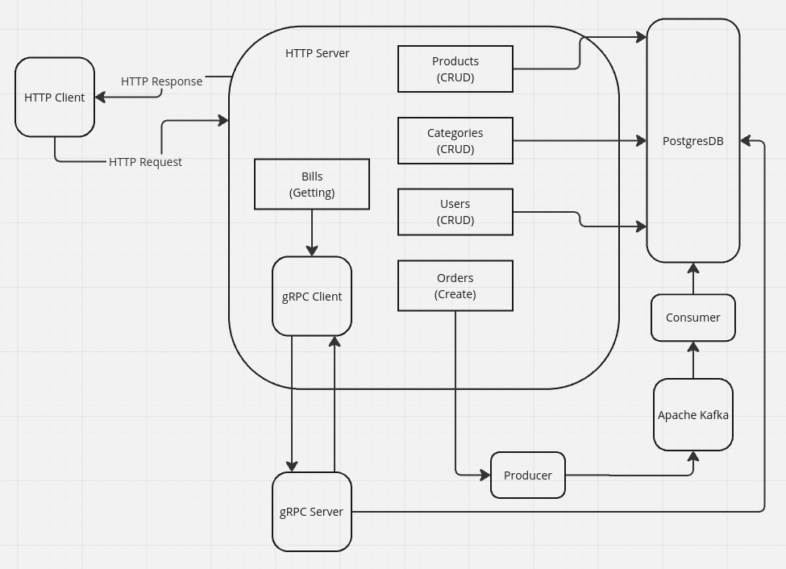

# eCommerce App
In project used hexagonal architecture where it possible.
Contains multiple microservices.

- Web App gateway
- Message broker
- Service calling by gRPC
- Postgres DB



## Preparing
```console
$ docker compose up -d
$ make prepare
# seed mock data if needed
$ make seed_data
```
## Starting
```console
# start web interface
$ make run_web
# start kafka consumer
$ make run_consumer
# start grpc server
$ make run_grpc
```
## Run tests
```console
$ make test
```

## Example of usage
```console
# getting user
$ curl 'localhost:8080/users?limit=1' | jq
[
    {
        "id":"87729c8b-4eaa-4fdd-9144-2906f0552bf7",
        "first_name":"Ivan",
        "last_name":"Ivanov"
    }
]

# getting product
$ curl 'localhost:8080/products?limit=1' | jq
[
    {
        "id":"f5c1c40a-6f27-429d-8727-abf45f5ad852",
        "title":"product#1",
        "category":{
            "id":"62be83f9-8499-4b73-91f9-7354bc0427e2",
            "title":"category#56",
            "code":"cat#56"
        },
        "price":84.08
    }
]

# creating order
$ curl -X POST localhost:8080/orders \
    -d '{"user_id":"87729c8b-4eaa-4fdd-9144-2906f0552bf7", \
    "product_id":"f5c1c40a-6f27-429d-8727-abf45f5ad852","amount":32}' -i

HTTP/1.1 200 OK
Date: Thu, 30 Jan 2025 06:23:47 GMT
Content-Length: 33
Content-Type: text/plain; charset=utf-8

Order have been placed to broker
```

## Examples of requests
```http
### expect code 201 and info about new product
POST localhost:8080/products
Content-Type: application/json

{
    "title": "product#1",
    "category": "1c27e74d-e71c-4dd4-8832-e1b8b67b2d97",
    "price": 723.21
}

### expect list of products by pages
GET localhost:8080/products?page=1&limit=20

### expect code 200 and info about updated product
PUT localhost:8080/products/bb5bc9e0-b3b6-4e2f-bdbc-ba95a38c0bed 
Content-Type: application/json

{
    "title": "upd product",
    "category": "1c27e74d-e71c-4dd4-8832-e1b8b67b2d97",
    "price": 321.5
}

### expect category
GET localhost:8000/categories/1c27e74d-e71c-4dd4-8832-e1b8b67b2d97

### expect code 204
DELETE localhost:8080/users/e2c39673-bb0e-4b93-9f64-15e4fd4990ab 
```
